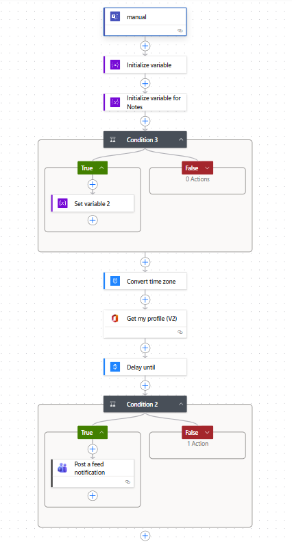
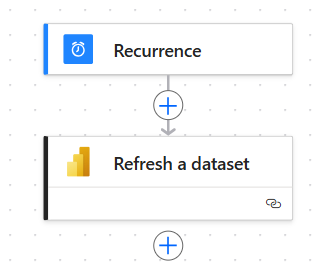
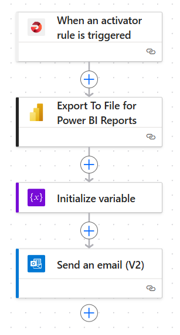
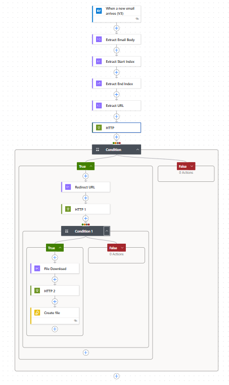
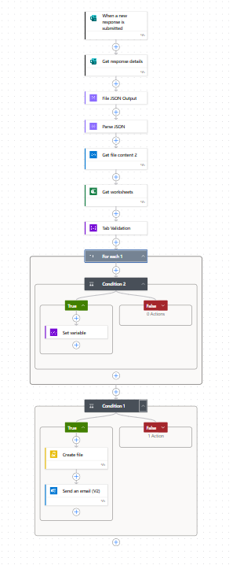

# ⚙️ PowerAutomate Next-Gen Marketing Analytics Automation
**Powered by:** Microsoft Power Automate | BigQuery | Power BI | Teams | PMG Analytics  

> **Automate Everything — From Inbox to Insight**  
> A cloud-integrated automation ecosystem that unites data ingestion, transformation, analytics, and stakeholder activation — all without human intervention.

---

## 🧩 Overview
This repository showcases **next-generation Power Automate workflows** designed to unify marketing and analytics ecosystems.  
From **email file ingestion** and **SFTP pipelines** to **BigQuery integration** and **Power BI auto-refresh**, these automations empower teams to operate at full intelligence and speed — providing real-time visibility, accuracy, and optimisation opportunities across every channel.

---

## 💡 Included Flows

| Flow | Description | Visual |
|------|--------------|---------|
| 🚀 **Flow – Intelligent Power BI Insights & Stakeholder Notifier** | A real-time communication engine that instantly delivers refreshed **Sales Data + Full Media Source Performance** across all digital, offline, and econometric touchpoints. This flow unifies **ad and social data, TV / OOH publisher reports, Google Trends, Econometrics (BigQuery APIs), Competitor Activity (subscription APIs), Email attachments, and Forecasting data** — consolidating it all into Power BI and automatically notifying **clients, performance teams, and account managers** in **Microsoft Teams**. Teams receive actionable insights and optimisation prompts for **budget reallocation, stress testing, and reinvestment** within minutes of refresh. |  |
| ⚡ **Flow – Continuous Power BI Auto-Refresh & Transparency Engine** | A game-changing orchestration flow ensuring **Power BI datasets refresh in perfect sync** with the latest data ingestions. Scheduled for early morning execution, it guarantees **marketing and client teams see accurate dashboards the moment their day starts** — providing immediate confidence, saving hours of manual checks, and reinforcing transparency. This automation ensures data freshness aligns with every ingestion cycle, delivering truly **always-on analytics**. |  |
| 📩 **Flow – Autonomous Daily Insight Email & Forecast Delivery** | A next-level automation that crafts and distributes **data-driven daily summaries and forecast insights** directly from Power BI. It transforms raw data into **concise, actionable investment optimisation plans** for the coming day/week — eliminating the need to chase publisher reports or manually reconcile performance. Teams receive **smart summaries highlighting emerging trends, channel synergies, and funnel opportunities**, shifting focus from report gathering to strategic action. |  |
| 🌐 **Flow – Dynamic SFTP URL Data Ingestion & Validation Pipeline** | A breakthrough automation that resolves a long-standing integration gap — when publisher or platform auto-emails only contain **secure URLs instead of attachments**. This flow dynamically retrieves those files, **downloads, validates, and securely transmits them** via SFTP Gateway into cloud infrastructure. It ensures seamless continuity across data sources, overcoming one of the most complex ingestion challenges in digital operations. |  |
| 🧩 **Flow – Autonomous MS Forms Data Capture & Pipeline Integrator** | A fully autonomous ingestion solution that instantly processes **MS Forms file submissions**, validating and transferring them through the SFTP Gateway to the analytics environment — **zero human involvement**. This automation eliminates delays and errors, seamlessly embedding ad-hoc submissions into the live data ecosystem and enriching reports and forecasts with real-time precision. |  |

---

## ⚙️ Architecture Overview

**Data Journey:**
1. **Ingest** — from emails, publishers, ad APIs, and forms  
2. **Validate & Transform** — via Power Automate and cloud connectors  
3. **Load** — into OneDrive, SharePoint, or Google BigQuery  
4. **Visualise** — in Power BI with real-time refresh  
5. **Notify** — via Teams and Email summaries  
6. **Optimise** — insights drive media reallocation, forecasting, and MMM readiness  

---

## 🚀 Why It Matters
This ecosystem:
- **Unifies all media and performance data** across channels and APIs  
- **Automates analytics end-to-end**, from ingestion to activation  
- **Saves hours of manual data handling and reporting**  
- **Delivers actionable insight before business hours begin**  
- **Empowers clients and teams** to reallocate and optimise spend in real time  

---
